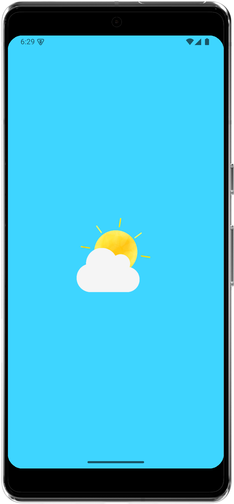
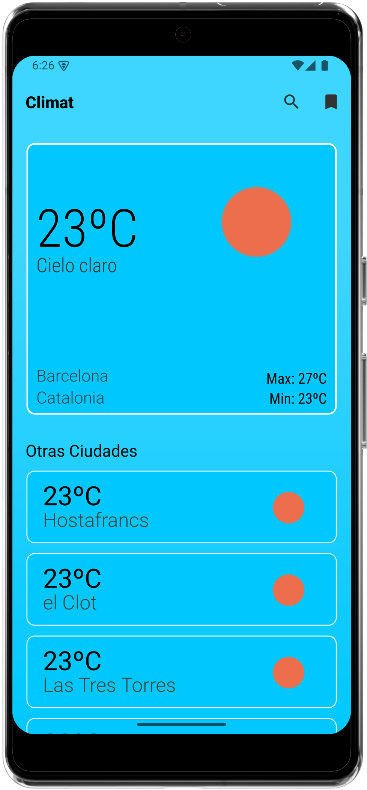
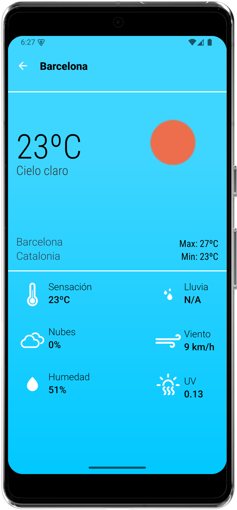
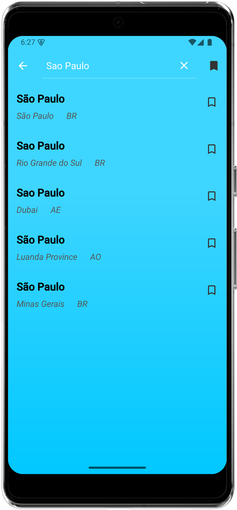
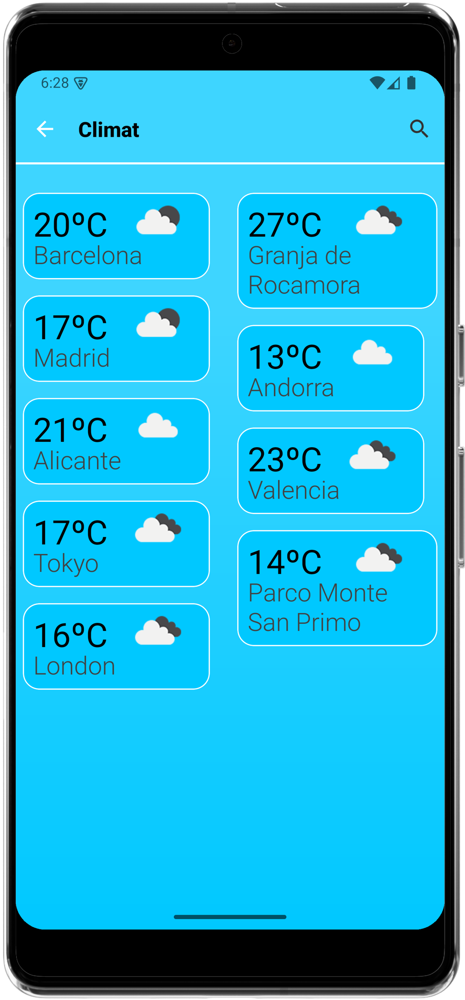

# ⛅ Climat

Android application that shows the current weather and nearby cities based on the user's location. Built with Kotlin and modern Android architecture using Retrofit, LiveData, and more.

The app allows users to search for cities, view detailed weather information, and save favorites.

---

## 🖼️ Screenshots

          

---
     

---

## 🚀 Features

- ✅ Detects user's current location via GPS
- 🌤️ Displays current weather with icons, temperature, and description
- 📍 Lists nearby cities with their weather
- 🔍 Search for any city by name with suggestions
- ⭐ Save favorite cities locally using Room database
- 🔄 Pull to refresh to reload weather data
- ⚠️ Handles network and GPS errors with custom dialogs
- ✨ Shimmer effect while data is loading

---

## 🛠️ Built With

- **Kotlin**
- **Views XML**
- **Retrofit** – for calling OpenWeatherMap and OpenUV APIs
- **Room** – to store favorite cities
- **Coroutines** – for asynchronous tasks
- **Glide** – to load weather icons
- **ShimmerLayout** – loading animations
- **RecyclerView + ConstraintLayout** – for flexible UI
- **SwipeRefreshLayout** – refresh gesture

---

## 🌐 APIs Used

- [OpenWeatherMap API](https://openweathermap.org/api) – for weather data
- [OpenUV API](https://www.openuv.io/) – for UV index data

> 💡 Both APIs require an API key. Sign up on their websites to get your own (it's free!).

---

## 📦 Installation

1. Clone this repository:

```bash
git clone https://github.com/NabilBasriH/Climat-App.git
